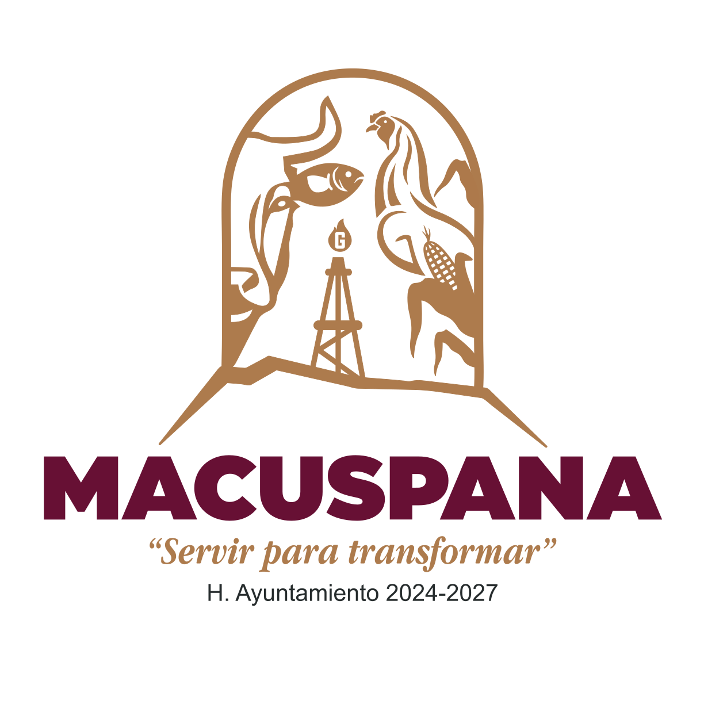

# SAC Macuspana

## Indice General

- [Documentación de Diseño](/diseno.md)
- [Especificación de Requisitos del Software](/especificacion-requisitos.md)
- [Manual de Configuración de la Base de Datos](/manual-configuracion.md)
- [Manual de Instalación](/manual-instalacion.md)
- [Manual Técnico de Configuración](/manual-tecnico.md)
- [Manual de Usuario](/manual-usuario.md)
- [Prototipado del Sistema](/prototipado.md)

## Tabla de Contenido

- [SAC Macuspana](#sac-macuspana)
  - [Indice General](#indice-general)
  - [Tabla de Contenido](#tabla-de-contenido)
  - [Introducción](#introducción)
    - [Propósito](#propósito)
    - [Alcance](#alcance)
    - [Definiciones, Acrónimos y Abreviaturas](#definiciones-acrónimos-y-abreviaturas)
    - [Responsables e Involucrados](#responsables-e-involucrados)
    - [Referencias](#referencias)
  - [Descripción General](#descripción-general)
  - [Situación Actual](#situación-actual)
  - [Situación Esperada](#situación-esperada)
  - [Justificación](#justificación)
  - [Observaciones](#observaciones)

---

## Introducción

El presente documento describe el Sistema de Atención Ciudadana (SAC), una aplicación web diseñada para facilitar la interacción entre los ciudadanos y la administración pública. Este sistema representa una solución integral para la gestión de trámites, solicitudes y reportes ciudadanos, proporcionando una plataforma digital moderna y eficiente.

### Propósito

El propósito de este documento es describir el SAC que se propone implementar en el municipio de Macuspana, Tabasco.

### Alcance

El SAC está diseñado para implementarse en el municipio de Macuspana, Tabasco. El sistema abarca los siguientes aspectos:

1. **Cobertura Geográfica**

   - Implementación inicial en el municipio de Macuspana
   - Accesible para todos los ciudadanos dentro de la jurisdicción municipal

2. **Componentes del Sistema**

   - Portal web ciudadano (Frontend)
   - Portal web administrativo (Frontend)
   - Sistema de gestión administrativa (Backend)
   - Base de datos centralizada
   - API REST para la comunicación entre componentes
   - Sistema de notificaciones

3. **Funcionalidades Principales**

   - Creación y seguimiento de solicitudes ciudadanas
   - Gestión de trámites municipales
   - Sistema de reportes de incidencias
   - Sistema de seguimiento y respuesta
   - Panel de administración para funcionarios
   - Registro y gestión de usuarios (funcionarios)
   - Generación de reportes y estadísticas

4. **Limitaciones**
   - El sistema no incluirá trámites que requieran presencia física obligatoria
   - No se contempla la integración con sistemas estatales o federales en esta fase
   - Los pagos en línea se limitarán a los servicios municipales autorizados y solo se podrán en los medios de pago habilitados

El alcance del proyecto incluye el desarrollo completo del sistema, documentación, capacitación del personal administrativo y soporte técnico durante la fase de implementación inicial.

### Definiciones, Acrónimos y Abreviaturas

- **SAC**: Sistema de Atención Ciudadana
- **API**: Interfaz de Programación de Aplicaciones
- **REST**: Transferencia de Estado Representacional
- **SQL**: Lenguaje de Consulta Estructurado
- **HTML**: Lenguaje de Marcado de Hipertexto
- **CSS**: Hojas de Estilo en Cascada
- **TS**: TypeScript
- **Vue**: Framework de JavaScript

### Responsables e Involucrados

| **Departamento**              | **Rol**                  | **Responsable**             |
| ----------------------------- | ------------------------ | --------------------------- |
| Presidencia Municipal         | Patrocinador             | Lic. Gaspar Diaz Falcon     |
| Atención Ciudadana            | Responsable del Proyecto | -                           |
| Tecnologías de la Información | Equipo de Desarrollo     | MIDS. Daniel Alvarez Garcia |

### Referencias

- [Manual de Usuario](/manual-usuario.md)
- [Manual Técnico de Configuración](/manual-tecnico.md)
- [Manual de Instalación](/manual-instalacion.md)
- [Manual de Configuración de la Base de Datos](/manual-configuracion.md)

## Descripción General

El municipio de Macuspana, Tabasco requiere un que permita a los ciudadanos realizar trámites, solicitudes y reportes de incidencias de forma digital. Con la finalidad de hacer eficiente estos procesos que comúnmente se tenían que hacer largas colas que resultaba en una perdida de tiempo tanto para el ciudadano como para la dependencia. El SAC es una aplicación web que proporciona una interfaz amigable y accesible para los ciudadanos, así como un portal administrativo para los funcionarios municipales.

## Situación Actual

Actualmente, el municipio de Macuspana enfrenta diversos desafíos en la gestión de servicios y atención ciudadana:

1. **Procesos Manuales**

   - Los trámites se realizan de manera presencial y con documentación física
   - El seguimiento de solicitudes se hace manualmente mediante archivos y carpetas
   - La comunicación con los ciudadanos depende de llamadas telefónicas o visitas presenciales

2. **Limitaciones Operativas**

   - Largas filas y tiempos de espera prolongados
   - Horarios de atención limitados
   - Capacidad reducida para atender múltiples solicitudes simultáneas
   - Dificultad para dar seguimiento a las solicitudes ciudadanas

3. **Gestión de Información**

   - No existe un sistema centralizado de información
   - La documentación se encuentra dispersa en diferentes departamentos
   - Falta de estadísticas precisas sobre la atención ciudadana
   - Riesgo de pérdida de documentos físicos

4. **Recursos Humanos**
   - Personal sobrecargado con tareas administrativas manuales
   - Tiempo considerable dedicado a la búsqueda y archivo de documentos
   - Dificultad para coordinar acciones entre diferentes áreas

Esta situación resulta en una experiencia poco satisfactoria para los ciudadanos y una carga administrativa significativa para el personal municipal.

## Situación Esperada

El SAC busca mejorar la eficiencia y calidad de los servicios municipales, proporcionando una plataforma digital que permita a los ciudadanos realizar trámites y solicitudes de forma rápida y sencilla. Se espera que el SAC ofrezca los siguientes beneficios:

1. **Automatización de Procesos**

   - Digitalización de trámites y solicitudes
   - Seguimiento en tiempo real de las solicitudes ciudadanas
   - Notificaciones automáticas sobre el estado de las solicitudes

2. **Accesibilidad y Comodidad**

   - Disponibilidad las 24 horas del día, los 7 días de la semana
   - Interfaz amigable y fácil de usar para los ciudadanos
   - Reducción de tiempos de espera y filas

3. **Gestión Eficiente**

   - Centralización de la información en una base de datos
   - Generación de reportes y estadísticas sobre la atención ciudadana
   - Facilidad para coordinar acciones entre diferentes áreas

4. **Mejora en la Experiencia Ciudadana**

   - Mayor transparencia en los procesos administrativos
   - Mayor satisfacción de los ciudadanos con los servicios municipales
   - Reducción de la carga administrativa para el personal municipal

El SAC se convertirá en una herramienta fundamental para la administración municipal, permitiendo una gestión más eficiente y una atención ciudadana de calidad.

## Justificación

La implementación del SAC es fundamental para modernizar y optimizar los procesos administrativos del municipio de Macuspana. Este sistema permitirá una gestión más eficiente de los trámites y solicitudes ciudadanas, reduciendo tiempos de espera y mejorando la satisfacción de los ciudadanos. Además, la digitalización de los procesos contribuirá a una mayor transparencia y facilitará la generación de estadísticas y reportes que apoyen la toma de decisiones. En resumen, el SAC es una herramienta clave para mejorar la calidad de los servicios municipales y fortalecer la relación entre la administración pública y los ciudadanos.

## Observaciones

- El presente documento es una versión preliminar y está sujeto a modificaciones y actualizaciones.
- Para más información sobre el funcionamiento del SAC, consulte el [Manual de Usuario](/manual-usuario.md).
