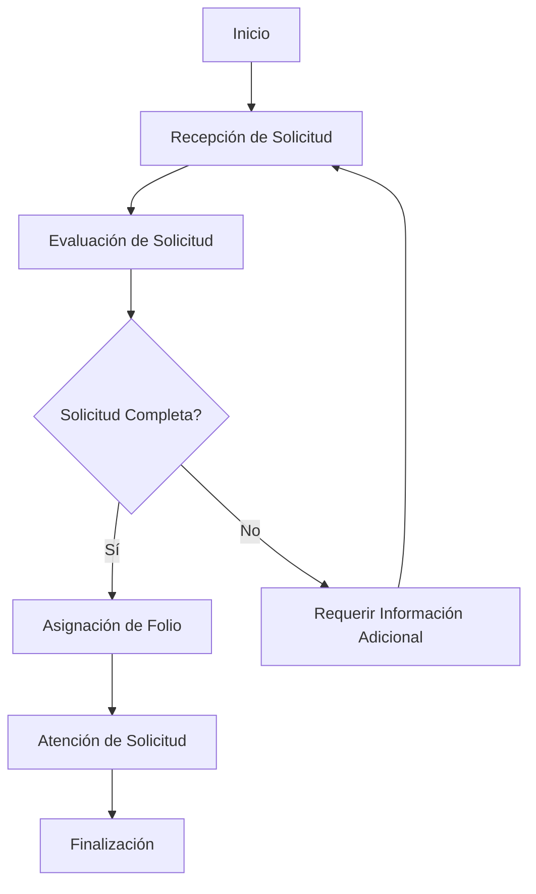

# Documentación del Sistema de Atención Ciudadana Macuspana

## Diagrama de Flujo
El diagrama de flujo del sistema de atención ciudadana de Macuspana se muestra a continuación:

```mermaid
graph TD
    A[Inicio] --> B[Recepción de Solicitud]
    B --> C[Evaluación de Solicitud]
    C --> D{Solicitud Completa?}
    D -->|Sí| E[Asignación de Folio]
    D -->|No| F[Requerir Información Adicional]
    F --> B
    E --> G[Atención de Solicitud]
    G --> H[Finalización]
```